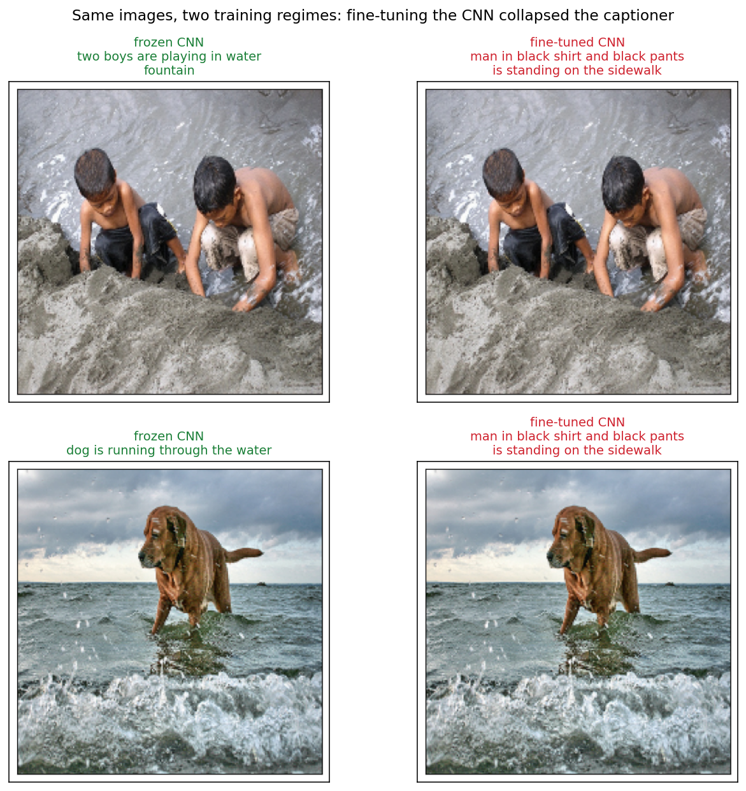

# Image Captioning and Intent Classification

Two sequence-modelling projects in one repository: generating a sentence that
describes a photograph, and classifying an utterance into coarse and fine intent
labels.



## Requirements

Python 3.10 or later. Both projects need their own dataset: a captioning corpus
of images with reference sentences, and a labelled set of utterances with main
and sub class annotations.

## Installation

```bash
pip install -e .
```

With the test suite:

```bash
pip install -e ".[dev]"
```

## Usage

Train a captioner and caption an image:

```python
from captioning import build_captioner, caption_image

captioner, encoder = build_captioner(vocab_size, max_length, trainable_cnn=False)
captioner.fit([images, input_tokens], target_tokens, epochs=15)
print(caption_image(captioner, encoder, image, tokenizer, max_length))
```

Train an intent classifier and score it:

```python
from intent import build_two_head, evaluate

model = build_two_head(vocab_size, sequence_length, num_main_classes, num_sub_classes)
model.fit(tokens, {"main_class": main_labels, "sub_class": sub_labels}, epochs=20)
print(evaluate(sub_labels, model.predict(tokens)[1]).format())
```

## Results

### Image captioning

A ResNet encoder projects the image to a single 300-dimensional vector, which is
prepended to the word embedding sequence and read by an LSTM as its first token.
Trained twice on the same data, once with the encoder frozen and once fine-tuned
end to end.

The frozen encoder describes each image. The fine-tuned one emits the same
sentence for every image in the test set, "man in black shirt and black pants is
standing on the sidewalk", regardless of what it is shown.

That is a collapse rather than a poor score. Training a pretrained CNN on a small
captioning set at the decoder's learning rate destroys the visual features before
the decoder learns to use them. The decoder then does the only thing left
available: it learns the most probable caption in the training distribution and
emits it unconditionally. The loss curve alone does not show this, since the loss
still falls. `trainable_cnn=True` reproduces it.

### Intent classification

An LSTM over utterance tokens, in two arrangements: one softmax over the flat
label set, and a shared encoder with separate heads for the coarse and fine
labels.

| model | hidden units | main accuracy | sub accuracy |
| --- | --- | --- | --- |
| single head | 100 | 96.7% | |
| single head | 25 | 95.2% | |
| two heads | 100 | 96.1% | 98.9% |
| two heads | 25 | 96.4% | 98.7% |

Widening the LSTM from 25 to 100 units buys about 1.5 points on the single-head
model and nothing on the two-head one, worth knowing before paying for the larger
model.

The sub-class accuracy needs care. 98.9% looks like the strongest number here and
is the weakest result in the table. The sub-class label set is large and heavily
skewed, so a model leaning on the frequent labels scores very high accuracy while
doing little on the rest. `intent.metrics.evaluate` reports macro and micro F1
alongside accuracy for exactly this reason, and a test shows a classifier that
always predicts the majority class scoring 95% accuracy and under 0.5 macro-F1.

## Design notes

`build_captioner` returns the encoder alongside the model. Greedy decoding runs
the decoder once per generated word, and without a handle on the encoder the
image would be pushed through the whole CNN again at every step. `greedy_decode`
takes a step function so the caller decides what is cached between steps, and
generation is kept separate from any plotting.

## Project structure

```
captioning/
    model.py      CNN encoder and LSTM decoder, encoder exposed for reuse
    decoding.py   greedy decoding with a caller-controlled step function
intent/
    model.py      single-head and shared-encoder two-head classifiers
    metrics.py    accuracy, macro and micro F1 over a whole split
tests/            decoding behaviour, metric behaviour, model wiring
docs/             figures referenced by this README
pyproject.toml    dependencies
```

## Components

| module | responsibility |
| --- | --- |
| `captioning.model` | Builds the encoder, decoder and combined captioner |
| `captioning.decoding` | Token-by-token generation, independent of any model |
| `intent.model` | Builds both classifier arrangements |
| `intent.metrics` | Label handling and split-level scoring |

## Testing

```bash
python -m pytest tests/
```

Fourteen tests. The captioner is built against a small stand-in backbone, so
nothing is downloaded and the suite runs in seconds.
